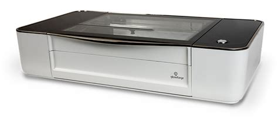
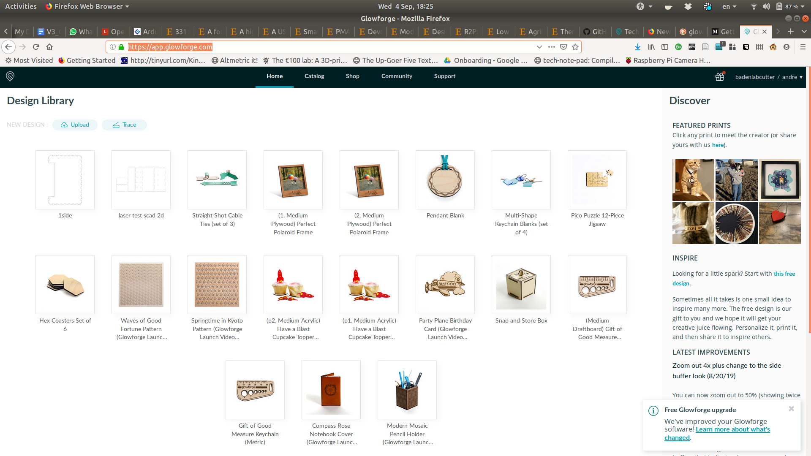

# Laser Cutter

### Summary

The lab's laser cutter is a [glowforge](https://glowforge.com/). The basic model without the built in filter.

- Tech Specs:
 - Material max dimensions: 45.7 X 51.8 cm (18 x 20.4 inches)
 - file formats JPG, PNG, SVG, PDF
 - 40W laser
 - can cut:
   - Leather
   - Wood
   - Fabric
   - Paper
   - Plexiglas (acrylic)
   - Delrin (acetal)
   - Mylar
   - Rubber
   - Corian
   - Foods
  - Can engrave same as cut plus:
   - Glass
   - Coated metal
   - Marble
   - Anodized aluminum
   - Titanium

- Good for:
 - prototyping of large pieces

- Downside when things go wrong:
 - getting dimensions wrong wastes a lot of material!

## Using the laser cutter:

The lasercutter is operated via a webapp, which means the cutter needs to be connected to the internet during operation using the same network as the computer running the webapp.

Given the current location of the cutter, we needed an 4G access point. It is an EE box, with a pre paid data plan (10£ for 2Gb of data, that expires every 2 months).

The webapp can be accessed at: https://app.glowforge.com/

For login and password info, contact Tom or Andre.

- steps for actually cutting things:
  - Make a design in a software that can export in one of the following formats: JPG, PNG, SVG, PDF
  - upload it using the webapp interface. 

  - when you select "print" the system is going to take a picture of what is inside the cutter.
   - place your design on the appropriate place on top of your material image.
   - make sure the system is focused (there is an autofocus button on the webapp)/
   - wait for magic to happen

## other notes:
- In case the cutter needs to be reset, turn the machine one, and press the big button for 30 sec.

Cutting speed depends on many things:

    The Glowforge Pro and Glowforge Plus cut about 20% faster than Basic.
    The faster the laser moves, the more power is required.
    Thicker material requires more power and more time. Twice as thick takes more than twice as long to cut through.
    The chemical composition of the material makes a huge difference. Some 1/4" plywood cuts quickly; some 1/8" plywood is impenetrable.

This is why we offer Proofgrade™ materials - we want you to have consistent materials where you know that you can cut through every time, and you know how long it will take. If you use your own materials, you will need to do some experimentation.

For engraving, cutting speed depends on two things:

    How fast you move the laser head - slower makes the engraving deeper and, in some cases, darker.
    How big the area to be engraved is. The head must move over the area to be engraved, and while Glowforge is smart about setting its path, two dots an inch apart will take longer than two dots right next to each other.

The average print time is 12 minutes. The longest prints - full detailed engravings that cover the entire bed - can take up to 3 hours.
